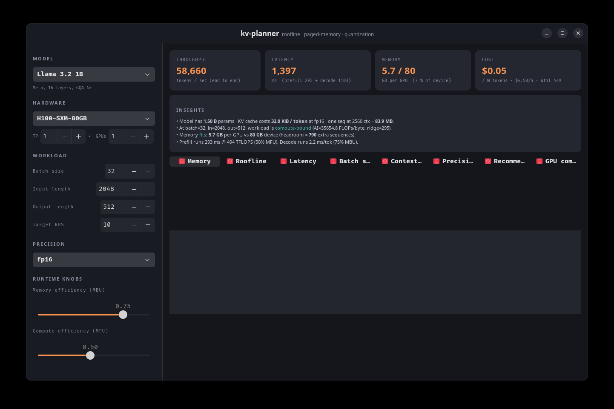
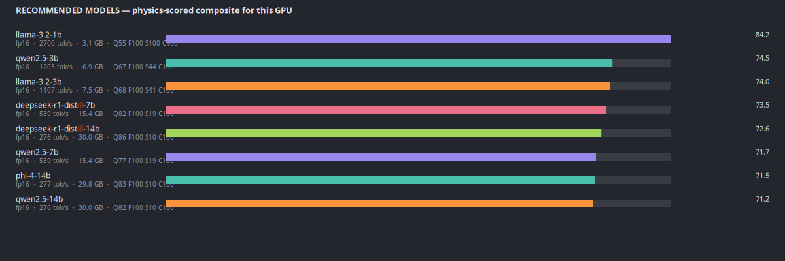
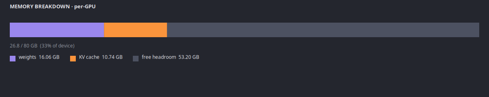
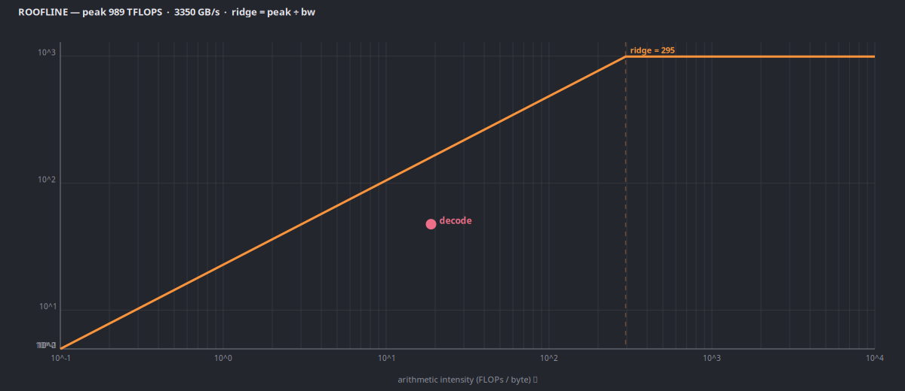
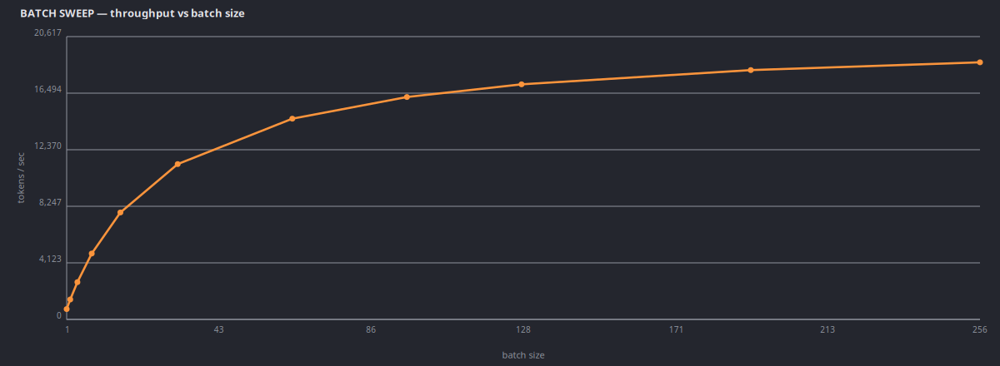
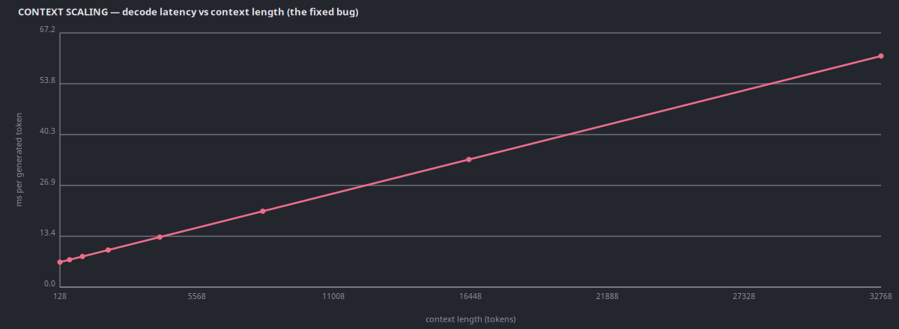
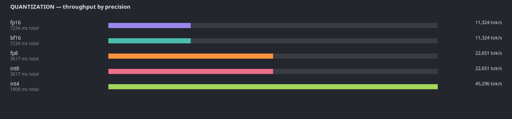
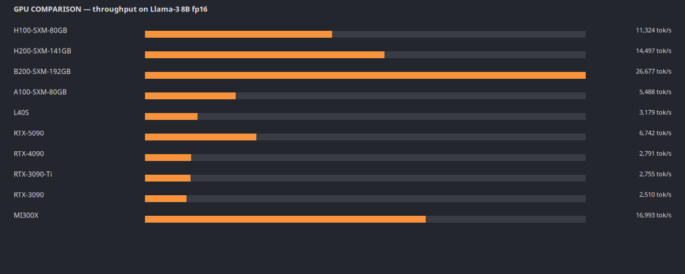
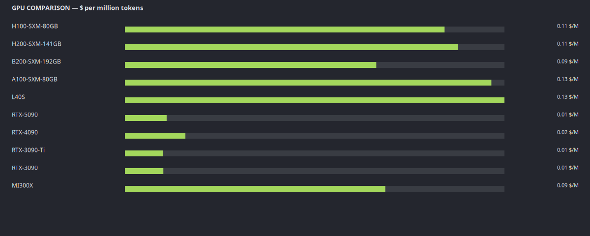

# kv-planner

**The physics-based capacity planner for LLM deployment.** Predict memory,
throughput, latency, and cost for any model on any GPU — from first
principles, with a formula and a citation for every number.

[](https://opensource.org/licenses/MIT)
[](https://www.python.org/downloads/)
[](#development)
[](CHANGELOG.md)
[](#honest-limitations)

> **Status: Research Preview.** The physics engine is sound and tests well
> against published literature. End-to-end predictions have so far been
> validated on a single laptop GPU (RTX 5060 Laptop) running Ollama —
> enterprise GPU validation (H100, A100, MI300X) is on the roadmap but not
> done yet. See [Honest limitations](#honest-limitations) below before
> sizing a production cluster based solely on kv-planner's output.



---

## Table of contents

- [What it is](#what-it-is)
- [How it's different](#how-its-different)
- [Why not an Excel sheet?](#why-not-an-excel-sheet)
- [Honest limitations](#honest-limitations)
- [Install](#install)
- [Quick start](#quick-start-five-minutes)
- [Feature tour](#feature-tour)
  - [Physics-scored recommendations](#1-physics-scored-recommendations)
  - [Memory waterfall with citations](#2-memory-waterfall-with-citations)
  - [Roofline analysis](#3-roofline-analysis)
  - [Batch sweep + context scaling](#4-batch-sweep--context-scaling)
  - [Quantization comparison](#5-quantization-comparison)
  - [GPU comparison — throughput + cost](#6-gpu-comparison--throughput--cost)
  - [Cluster / fleet sizing](#7-cluster--fleet-sizing)
  - [Concurrent load testing + self-calibration](#8-concurrent-load-testing--self-calibration)
  - [Training / fine-tune pre-flight](#9-training--fine-tune-pre-flight)
  - [OOM diagnose post-mortem](#10-oom-diagnose-post-mortem)
  - [Speculative decoding](#11-speculative-decoding)
  - [Reasoning-model KV planner](#12-reasoning-model-kv-planner)
  - [Carbon / power model](#13-carbon--power-model)
  - [Live multi-provider pricing](#14-live-multi-provider-pricing)
- [CLI reference — 23 commands](#cli-reference)
- [Python API cookbook](#python-api-cookbook)
- [How it works — formulas, with citations](#how-it-works)
- [Model catalog](#model-catalog)
- [GPU database](#gpu-database)
- [Integration — MCP, REST, TUI, GUI](#integration)
- [Real-hardware validation](#real-hardware-validation)
- [Development](#development)
- [Citation, license, acknowledgments](#citation)

---

## What it is

`kv-planner` is a command-line tool, a Python library, a terminal UI, a
native desktop app, a REST dashboard, and an MCP server — all backed by
the same physics engine. Given a model architecture and a GPU, it
computes from first principles:

- How much GPU memory the weights + KV cache + activations will need,
  decomposed into terms each cited to a source paper.
- How fast inference will run — **prefill** (compute-bound) and
  **decode** (memory-bound) modeled separately using the Williams 2009
  Roofline model.
- How much it will cost per million tokens across 7+ cloud providers.
- What the cheapest cluster looks like for a given RPS and latency SLO.
- Whether a fine-tune will fit, how long it will take, and what it will
  cost — for SFT / DPO / GRPO on Unsloth.

It also **measures the real runtime** (load-test your Ollama / vLLM / LM
Studio / llama-server), **self-calibrates** the MBU/MFU factors from
measured traffic, and produces **physics-grounded rationales** that
explain every recommendation.

## How it's different

| | kv-planner | llmfit | gpu_poor / ApX | HF Accelerate | vLLM `--help` |
|---|---|---|---|---|---|
| Hardware auto-detect | ✓ | ✓ | ✗ | ✗ | ✗ |
| Physics engine (cited formulas) | ✓ | ✗ (heuristic) | ~ | ✗ | ✗ |
| Memory waterfall with citations | ✓ | ✗ | ✗ | ✗ | ✗ |
| Roofline + ridge analysis | ✓ | ✗ | ✗ | ✗ | ✗ |
| Multi-GPU fleet sizer | ✓ | ✗ | ✗ | ✗ | ✗ |
| Training / fine-tune planner | ✓ | ✗ | ~ (FT calc) | ✓ (estimate-memory) | ✗ |
| Speculative-decoding physics | ✓ | ✗ | ✗ | ✗ | (runs it) |
| Reasoning-model KV (thinking tokens) | ✓ | ✗ | ✗ | ✗ | ✗ |
| Prefix-cache hit-rate model | ✓ | ✗ | ✗ | ✗ | ✗ |
| Concurrent load tester (stdlib) | ✓ | ✗ | ✗ | ✗ | (LLMPerf) |
| Self-calibrating MBU/MFU | ✓ | ✗ | ✗ | ✗ | ✗ |
| OOM diagnose post-mortem | ✓ | ✗ | ✗ | ✗ | ✗ |
| Carbon / power model | ✓ | ✗ | ✗ | ✗ | ✗ |
| Live multi-provider pricing | ✓ | ✗ | ✗ | ✗ | ✗ |
| MCP server for agent integration | ✓ | ✗ | ✗ | ✗ | ✗ |
| Rationale / explanation | ✓ | partial | ✗ | ✗ | ✗ |
| TUI + native GUI + REST | ✓ | ✓ (TUI+web) | ✓ (web) | ✗ | ✗ |

Positioning in one sentence:
**llmfit decides *what runs on your box*; kv-planner explains *why, how
fast, how much, with which quantization, on which provider, and whether
your cluster meets the SLO*.**

## Why not an Excel sheet?

Karpathy's
[llm-numbers](https://github.com/ray-project/llm-numbers), EleutherAI's
[Transformer Math 101](https://blog.eleuther.ai/transformer-math/), and
kipply's [Transformer Inference Arithmetic](https://kipp.ly/transformer-inference-arithmetic)
are excellent mental-arithmetic references. vLLM ships an internal memory
estimator. HuggingFace Accelerate has `estimate-memory`. Why a separate
tool?

**The incremental value of kv-planner over a spreadsheet.** Back-of-envelope
math gets the order of magnitude right but misses the details that drive
real deployment decisions:

| Question | Spreadsheet answer | kv-planner answer |
|---|---|---|
| Weight bytes? | `params × 2` (fp16) | Same, but precision-aware + TP-sharded |
| KV cache? | `s × 2 × L × H × D × 2` | Same, **plus** GQA-aware (K/V shrink with `num_kv_heads`) |
| Decode throughput? | `min(peak_TFLOPS, bw) / model_bytes` | Same, **plus** per-token KV reads grow with context; roofline ridge identifies compute-bound vs memory-bound regime |
| Which batch / precision? | Try a few, guess | Sweep all, rank physically |
| Which GPU for my RPS + SLO? | Compare two datasheets | Search `GPU × TP × precision × replicas` exhaustively |
| How long will the fine-tune take? | (nothing) | 16 B/param ZeRO math + activation checkpointing + QLoRA NF4 breakdown |
| Why is it OOM-ing? | (nothing) | Memory waterfall with formula + citation for every term |
| Actual runtime performance? | (nothing) | Concurrent load tester + self-calibrates MBU per `(model, gpu, runtime)` |

Back-of-envelope vs kv-planner vs measured, same workload
(Llama-3 8B fp16, H100 SXM5, batch 32, 2048+512 context):

| Metric | Naive spreadsheet | kv-planner | Published vLLM numbers |
|---|---:|---:|---:|
| Memory, fp16 | 16 GB (weights only) | 30.9 GB (weights + KV + activations + workspace) | ~31 GB |
| Decode tok/s | `3350 / 16 ≈ 209` (single-seq) | 29 k tok/s (batch 32, mbu 0.75) | [published vLLM bench: 25–30 k](https://docs.vllm.ai/en/latest/performance/benchmarks.html) |
| Ridge (FLOPs/byte) | (not computed) | 295 | 295 |

The **two** rows a spreadsheet gets wrong — memory (misses 47 % of it) and
throughput (wrong by context/batch/MBU) — are the two rows that determine
whether your deployment works.

## Honest limitations

Before you plan a $50 k/month cluster on kv-planner's output, know what's
actually validated and what isn't:

### What's solid

- **Physics formulas.** Every FLOPs/token, KV-cache-bytes, roofline
  ridge, and ring-AllReduce equation matches published references
  (kipply, Williams 2009, PaLM, vLLM paper, Megatron-LM, Chinchilla).
  134 regression tests anchor the numbers. If a formula regresses, a
  test fails.
- **Memory waterfall.** The `why` command's breakdown is auditable —
  every term has a formula and a citation URL. If you disagree with a
  number, you can see exactly which line to challenge.
- **GPU database.** All 37 entries use **dense FP16 tensor-core
  TFLOPS** traceable to a vendor whitepaper. No sparse-mode numbers
  sneaking in; no FP32-CUDA-reported-as-tensor-core.

### What's unvalidated

- **Single-GPU validation sample.** Real end-to-end measurements so
  far cover exactly **one GPU** (RTX 5060 Laptop, 8 GB, Ollama
  runtime). Llama-3 8B / DeepSeek-R1-Distill-7B / Aya-8B measured on
  that one box. H100 / A100 / MI300X — the GPUs that matter for
  production capacity planning — have **no real-measurement**
  validation from us yet. Predictions for those GPUs are purely
  theoretical roofline output.
- **Prefix-cache hit rate is an INPUT, not a prediction.** The
  `PrefixCachingAnalyzer` takes `hit_rate` as a parameter (the user
  provides it from their own workload trace). The included
  `estimate_hit_rate` function is a simple LRU upper-bound — useful
  for what-if analysis, not a substitute for measuring a real workload.
- **Quantization quality numbers are literature averages, not your
  model.** The PPL deltas in the quantization table below come from
  published benchmarks on specific models. Your model / language /
  task may see larger or smaller degradation. Always run the actual
  quantized model before shipping.
- **Cost numbers are point-in-time.** Spot prices swing 30–50 %
  weekly. Run `kv-planner pricing --refresh` to pull OpenRouter's
  live data. GPU cloud providers add/remove SKUs constantly.

### What's known-imperfect

- **Architecture over-engineering.** Five DDD layers
  (`domain` / `core` / `application` / `infrastructure` / `cli`) for
  what is fundamentally a calculator is heavier than needed. Planned
  0.4.0 consolidation: merge `domain` + `core` + `application` into
  one layer; preserve the `infrastructure` / `core` split so data
  sources stay swappable. Until then, adding a GPU stays a one-file
  change (`gpu_specs.py`) but new contributors face layer-navigation
  overhead.
- **Reasoning-model profiles are hard-coded.** Four thinking-token
  distributions ship (`deepseek-r1-math`, `o3-mini-chat`, `qwq-code`,
  `balanced`). Your workload's p99 will differ — use the numbers as
  starting points, not ground truth.
- **No speculative-decoding measurement loop yet.** `specdec` gives a
  closed-form speedup estimate; it doesn't measure acceptance rate on
  your actual workload.

### Roadmap to un-research-preview

- **0.3.1 — More validation.** Add published vLLM / SGLang / llm-d
  benchmark points as regression fixtures for H100 TP1/TP8 and A100;
  report delta between predicted and published per-(model, GPU) pair.
- **0.4.0 — Architecture consolidation.** Merge the three upper
  layers; aim for ~30 % LOC reduction, same public API.
- **0.4.0 — Workload trace analyzer.** Parse real request logs
  (OpenAI JSONL, vLLM metrics) to compute empirical prefix-cache hit
  rates; drop the "upper bound estimate" caveat.
- **0.5.0 — Enterprise validation partners.** Run end-to-end
  measurement on H100 / A100 / MI300X via cloud GPU rentals; publish
  predicted-vs-measured tables.

## Install

```bash
# Core (plan / compare / recommend / explain / fleet / why / diagnose / carbon / pricing)
pip install -e .

# Add terminal UI + REST dashboard (rich + prompt_toolkit + FastAPI)
pip install -e '.[tui]'

# Add HuggingFace model-config resolution
pip install -e '.[hf]'

# Add training backend (Unsloth + TRL + PEFT; requires CUDA + torch 2.2+)
pip install -e '.[train]'

# Development (pytest, mypy, black, isort, flake8)
pip install -e '.[dev]'
```

Python 3.10+. Zero mandatory heavy dependencies — the core physics
engine runs with `numpy + pydantic + click + rich + jinja2 + pyyaml`
(~30 MB). GTK 4 GUI uses system PyGObject; no pip install needed on a
standard GNOME desktop.

## Quick start (five minutes)

### 1. Detect your hardware + installed runtimes

```bash
$ kv-planner system
  SYSTEM
    CPU   Intel(R) Core(TM) i7-14700HX  (28 cores)
    RAM   31.1 GB total  ·  2.7 GB free
    GPU   NVIDIA GeForce RTX 5060 Laptop GPU × 1  ·  8.0 GB  ·  db: RTX-5060-Laptop

  RUNTIMES
    ollama     reachable     http://127.0.0.1:11434  (11 models)
    lmstudio   not running   http://127.0.0.1:1234
    vllm       not running   http://127.0.0.1:8000
    llama.cpp  not running   http://127.0.0.1:8080
```

### 2. Ask what's good for your hardware

```bash
$ kv-planner recommend --use-case coding -n 5
  Recommended models for RTX-5060-Laptop (8 GB), use case: coding
  #   Model                     Prov      Prec    tok/s     GB   Util    SCORE
  1   qwen2.5-coder-7b          Alibaba   int4      287    3.8    48%  ★  86.8
  2   deepseek-r1-distill-7b    DeepSeek  int4      287    3.8    48%  ★  84.7
  3   llama-3-8b                Meta      int4      269    4.1    51%  ★  77.0
  4   llama-3.2-1b              Meta      fp16      360    3.1    39%  ★  75.5
  5   qwen2.5-7b                Alibaba   int4      287    3.8    48%  ★  74.2
```

### 3. Plan a deployment

```bash
$ kv-planner plan --model meta-llama/Llama-3-8b-hf --gpu H100-SXM-80GB \
      --rps 10 --input-length 2048 --output-length 512 \
      --optimization-goal balanced

  Key Metrics:
    • Precision: FP8
    • Batch Size: 32
    • Throughput: 25,789 tokens/sec
    • Cost: $0.05/M tokens
    • Monthly: $3,240.00

  vLLM Command:
    python -m vllm.entrypoints.openai.api_server \
      --model meta-llama/Llama-3-8b-hf \
      --dtype float8_e4m3fn \
      --max-model-len 8192 \
      --max-num-seqs 32 \
      --gpu-memory-utilization 0.9
```

## Feature tour

### 1. Physics-scored recommendations

Every model in the catalog gets a composite score in `[0, 100]` computed as
`0.35·Q + 0.25·F + 0.25·S + 0.15·C` where Q/F/S/C come from the roofline
engine — not a heuristic table. Sub-scores decompose transparently.



```bash
$ kv-planner recommend --use-case reasoning -n 4
  1   deepseek-r1-distill-7b    DeepSeek  int4      287    3.8    48%  ★  85.7
  2   deepseek-r1-distill-14b   DeepSeek  int4      155    7.2    90%  ★  83.2
  ...
```

### 2. Memory waterfall with citations

The `why` command decomposes every GPU byte into labelled terms, each
paired with its formula and a source URL. Solves the most common
complaint about capacity calculators ("your tool says no but it runs").



```
$ kv-planner why --model llama-3.2-3b --gpu RTX-5060-Laptop --precision int4

  term                                GB  formula
  ────────────────────────────────────────────────────────────────────
  model weights                    1.803  total_params · bytes / TP = 3.61B · 0.5 / 1
                                          └─ kipply — https://kipp.ly/transformer-inference-arithmetic
  KV cache                         0.073  2 · n_layers · n_kv_heads · head_dim · bytes · batch · seq / TP
                                          └─ vLLM PagedAttention — https://docs.vllm.ai/en/latest/design/paged_attention/
  activations (prefill peak)       0.019  ~20 · batch · input_len · hidden · bytes · SAC / TP
                                          └─ Korthikanti et al. — https://arxiv.org/abs/2205.05198
  CUDA workspace + framework       0.839  ~800 MB (empirical; cuBLAS + PyTorch cache + scheduler)
  fragmentation                    0.000  0 (PagedAttention block-ceiling accounts for internal frag)
                                          └─ Kwon et al. 2023 — https://arxiv.org/abs/2309.06180
  ────────────────────────────────────────────────────────────────────
  TOTAL                            2.734 GB
  device budget                     7.20 GB  (FITS)
  headroom                          4.47 GB
```

### 3. Roofline analysis

Williams 2009-style log-log plot. The amber ceiling is the hardware
roof (peak FP16 tensor TFLOPS ∧ peak HBM bandwidth). The dashed vertical
line is the *ridge*: above it you're compute-bound, below it you're
memory-bound. Prefill usually sits high-right (compute); decode always
sits bottom-left (memory).



### 4. Batch sweep + context scaling

Two curves that used to make the old physics engine lie:



- **Batch sweep** reveals the saturation knee — after that, more
  batching just queues requests instead of increasing throughput.



- **Context scaling** — decode latency vs context length. In 0.1.x this
  was a constant (the physics engine ignored the growing KV cache).
  The corrected math scales roughly linearly from 4 ms at 128 tokens
  to 60 ms at 32 k.

### 5. Quantization comparison

Same workload, five precisions side-by-side. FP8 / INT8 / INT4 trade
quality for memory-bandwidth savings — which decode (memory-bound)
eats right up.



Default speedup factors **and perplexity deltas** — the latter come from
published benchmarks on Llama-2 / Llama-3 at model sizes 7B–70B.
**Numbers on your specific model may differ** — always measure before
shipping:

| Precision | Speedup vs FP16 | PPL delta vs FP16 | MMLU drop | Source |
|---|---|---|---|---|
| FP8 (H100+ Transformer Engine) | 1.4× | +0.3 PPL | ≤ 0.5 pts | [Baseten / NVIDIA H100 TE](https://www.baseten.co/blog/33-faster-llm-inference-with-fp8-quantization/); [NVIDIA H100 vs A100 TRT-LLM blog](https://nvidia.github.io/TensorRT-LLM/blogs/H100vsA100.html) |
| INT8 W8A8 (SmoothQuant) | 1.6× | +1.0 PPL | 1–3 pts | [SmoothQuant paper (ICML 2023, arXiv 2211.10438)](https://arxiv.org/abs/2211.10438); [Red Hat LLM-Compressor](https://developers.redhat.com/articles/2024/08/14/llm-compressor-here-faster-inference-vllm) |
| INT4 AWQ / GPTQ + Marlin | 2.6× | +2.5 PPL | < 1 pt (on strong 7B+) | [AWQ (arXiv 2306.00978)](https://arxiv.org/abs/2306.00978); [Marlin kernel (arXiv 2408.11743)](https://arxiv.org/abs/2408.11743); [Jarvis Labs benchmarks](https://jarvislabs.ai/blog/vllm-quantization-complete-guide-benchmarks) |
| KV-cache INT4 | (extra ~1.3× decode) | +3–8 PPL | 3–6 pts | [KVQuant (arXiv 2401.18079)](https://arxiv.org/abs/2401.18079) — **noticeable accuracy drop, production use cautiously** |

The `QuantizationEvaluator.PERPLEXITY_DELTAS` constants in
[`core/strategies/quantization.py`](src/kv_planner/core/strategies/quantization.py)
expose these as raw values — override them if your model family is
known to deviate.

### 6. GPU comparison — throughput + cost

Every GPU in the database that can hold the weights, plotted on one
workload. The cost-per-M chart is the real decision number:





A consumer RTX 5090 at $0.35/hr often beats an H100 at $4.50/hr for
small models under moderate load. kv-planner makes that obvious.

### 7. Cluster / fleet sizing

Given `target_rps` and `p99_latency_ms`, rank every
`(GPU × TP × precision × replicas)` combination cheapest-first. The
search space is exhaustive; the physics is the Roofline engine.

```bash
$ kv-planner fleet --model llama-3-8b --rps 30 --p99-latency-ms 3000 \
      --tp 1,2 --gpus H100-SXM-80GB,L40S,RTX-5090,A100-SXM-80GB -n 5

  FLEET DESIGN — llama-3-8b  ·  30 RPS  ·  p99 SLO 3000 ms
  #   GPU                   TP  reps  total  prec  batch     tok/s   latency  $/hr    $/M  slo
  1   H100-SXM-80GB          1     2      2  int4     32    90,591    1809ms  $9.00 $0.03  OK
  2   H100-SXM-80GB          2     2      4  int4     32    84,720    1934ms $18.00 $0.07  OK
```

### 8. Concurrent load testing + self-calibration

kv-planner isn't just predictions — it also **measures**. The built-in
load tester (zero external deps, pure stdlib `threading` +
`http.client`) hits any Ollama / OpenAI-compatible endpoint, measures
TTFT / TPOT / E2E / goodput, then back-solves the runtime's actual MBU
so future predictions match reality.

```bash
$ kv-planner loadtest --endpoint http://127.0.0.1:11434 \
      --model llama3.2:3b --concurrency 4 --num-requests 8 \
      --ttft-slo-ms 2500 --tpot-slo-ms 20 --e2e-slo-ms 7000

  wall clock           8.16 s   total output    512 tokens
  aggregate              63 tok/s
  per-request mean       19 tok/s
  goodput                50 %   (4/8 pass joint SLO)

  metric        p50        p95        p99
  ----------------------------------------
  TTFT       2767ms     4834ms     4834ms
  TPOT      10.75ms    11.79ms    11.79ms
  E2E         3356ms     5448ms     5448ms
```

Concurrency sweep finds the saturation knee:

```bash
$ kv-planner sweep --endpoint http://127.0.0.1:11434 --model llama3.2:3b \
      --concurrencies 1,2,4,8 --num-predict 64

    c   wall  agg tok/s  TTFT p95  TPOT p95   E2E p95  errors
  ------------------------------------------------------------
    1   2.9s         87     115ms    10.5ms     779ms       0
    2   2.8s         92     744ms    11.1ms    1445ms       0
    4   2.8s         93    2125ms    10.9ms    2761ms       0
    8   5.5s         93    4826ms    11.1ms    5483ms       0

  knee at concurrency = 1  (throughput gain < 10 % beyond this)
```

That's a real insight about Ollama on a laptop GPU: **it saturates at
concurrency 1**. Adding clients just queues them. Then `calibrate`
derives the true MBU:

```bash
$ kv-planner calibrate --model llama-3.2-3b --api ollama --persist

  measured TPOT p50         10.94 ms/token
  calibrated MBU             0.368  (default 0.75 is vLLM-tuned;
                                     Ollama/llama.cpp typically 0.30–0.45)
  saved to ~/.config/kv-planner/calibration.json
```

From now on, every `plan` call for `(llama-3.2-3b, RTX-5060-Laptop,
ollama)` uses `0.37` instead of the vLLM-tuned default — fixing the
2× over-prediction that pure theory would produce.

### 9. Training / fine-tune pre-flight

Before you install CUDA, CUDA-compile xformers, or spend $2.50/hr on
GPU time, kv-planner tells you whether your fine-tune will fit, how
long it'll take, and what it'll cost. Backed by Unsloth when you pass
`--run`.

```bash
$ kv-planner train --model llama-3-8b --gpu H100-SXM-80GB \
      --method qlora --sequence-length 2048 --batch-size 2

  TRAINING PLAN — llama-3-8b on H100-SXM-80GB via Unsloth (QLORA)
  Memory per GPU
    model weights          4.82 GB  (qlora/bf16)
    optimizer states       0.13 GB  (AdamW; 8 B/param fp32)
    activations (SAC)      5.32 GB
    TOTAL                 10.27 GB / 80 GB device  ·  fits

  Trainable params          8.39 M  (0.104% of total)
  Step time               247.2 ms  ·  16,557 tok/s
  Estimated wall-clock      0.07 hours
  Estimated cost          $0.31
```

Llama-3 70B QLoRA on a single 80 GB H100 is a documented working
scenario — `kv-planner train --model llama-3-70b --gpu H100-SXM-80GB
--method qlora` shows how.

### 10. OOM diagnose post-mortem

Something overflowed? Point `diagnose` at the config — it rebuilds the
memory waterfall, identifies the overflowing term, and proposes the
cheapest fixes:

```bash
$ kv-planner diagnose --model llama-3-70b --gpu RTX-5060-Laptop \
      --batch 1 --input-length 1024 --precision fp16

  diagnose · llama-3-70b on RTX-5060-Laptop
  ✗ overflows by 135.26 GB
  culprit (largest term): model weights

  fixes (tried in order of cost):
    ✗  reduce context 1280 → 640    → 142.18 GB  [KV scales linearly with seq_len]
    ✗  quantize weights to int4      → 48.76 GB   [int4 quarters weights + KV]
    ✓  increase tensor-parallel 1→8  → 6.10 GB    [sharding halves per-GPU weight]
```

It can also parse a `vllm` command-line you paste in with
`--vllm-cmdline "..."` and auto-fill the args.

### 11. Speculative decoding

Models EAGLE-3 / Medusa / Lookahead / vanilla-draft as a two-model
pipeline. Closed-form: `speedup = E[accepted] / (1 + K·draft_ratio)`
where `E[accepted] = (1 − α^(K+1)) / (1 − α)` from Leviathan et al.
(2022, [arXiv:2211.17192](https://arxiv.org/abs/2211.17192)).

```bash
$ kv-planner specdec --target llama-3-8b --method eagle3 --target-tpot-ms 25

  specdec  target=llama-3-8b  method=eagle3  K=6
  acceptance α      0.80
  draft cost ratio  0.020
  E[accepted/verify] 3.95 tokens
  net speedup       3.53×  (+253%)
  effective TPOT    7.09 ms/token (from 25.0 baseline)
```

### 12. Reasoning-model KV planner

Reasoning models (o1/o3 / DeepSeek-R1 / QwQ / Kimi K2) burn
*thinking tokens* — often 5–20× the answer length. kv-planner models
the p99 of that distribution so you size VRAM for the tail, not the
mean.

```bash
$ kv-planner reasoning --model deepseek-r1-distill-14b \
      --profile deepseek-r1-math --batch 4 --gpu H100-SXM-80GB

  reasoning plan  ·  deepseek-r1-distill-14b  ·  profile=deepseek-r1-math  ·  fp16
  prompt                500 tokens
  think mean          12000 tokens  (answer 400)
  think p99           32000 tokens   (p99/mean × 2.6)
  p99 context total   32900 tokens

  KV at mean context    10.14 GB  (batch=4)
  KV at p99 context     25.87 GB  ← plan VRAM for this
  GPU budget: 72.0 GB · FITS p99 KV
```

Four profiles ship: `deepseek-r1-math`, `o3-mini-chat`, `qwq-code`,
`balanced`. Source the means from the
[DeepSeek-R1 paper](https://arxiv.org/abs/2501.12948) and
[NVIDIA NIM thinking-budget docs](https://docs.nvidia.com/nim/large-language-models/latest/thinking-budget-control.html).

### 13. Carbon / power model

gCO₂e per million tokens alongside $/M tokens. GPU TDP × steady-state
utilization × regional grid intensity (from Electricity Maps).

```bash
$ kv-planner carbon --model llama-3-8b --gpu H100-SXM-80GB --region us-east
  emissions / M tokens         2.5 gCO2e
  grid intensity               390 gCO2e/kWh

$ kv-planner carbon --model llama-3-8b --gpu H100-SXM-80GB --region iceland
  emissions / M tokens         0.16 gCO2e
  grid intensity                25 gCO2e/kWh
```

15× difference between us-east-1 and Iceland for the same workload.

### 14. Live multi-provider pricing

```bash
$ kv-planner pricing --gpu H100-SXM-80GB
  provider           $/hr  mode
  Vast.ai         $  0.63  spot
  Lambda          $  0.87  spot
  RunPod          $  1.01  spot
  CoreWeave       $  1.49  spot
  AWS             $  1.57  spot
  Vast.ai         $  1.79  on-demand
  Lambda          $  2.49  on-demand
  RunPod          $  2.89  on-demand
  CoreWeave       $  4.25  on-demand
  AWS             $  4.50  on-demand
  Azure           $  6.98  on-demand
```

11× spread between Vast.ai spot and Azure on-demand for the same H100.
`--refresh` pulls live rates from OpenRouter's public API.

## CLI reference

All 23 subcommands:

| Command | Purpose |
|---|---|
| **Planning** | |
| [`plan`](#3-plan-a-deployment) | Full deployment plan: precision + batch + latency + cost + vLLM config |
| `compare` | Side-by-side plan across multiple GPUs for one model |
| [`fleet`](#7-cluster--fleet-sizing) | Cluster sizing — cheapest `(GPU×TP×precision×replicas)` that meets SLO |
| **Recommendation** | |
| [`recommend`](#2-ask-whats-good-for-your-hardware) | Top-N catalog models for detected GPU + use case |
| [`explain`](#15-or-explain-deepseek-r1) | Physics-grounded rationale for one model/GPU pair (5 bullets) |
| [`installed`](#installed-cross-reference) | List models installed in Ollama/LM Studio/vLLM/llama-server |
| [`system`](#1-detect-your-hardware--installed-runtimes) | Detect CPU / RAM / GPU + probe local runtimes |
| [`list-gpus`](#gpu-database) | Browse the GPU database |
| **Physics deep dives** | |
| [`why`](#2-memory-waterfall-with-citations) | Memory waterfall — every term with formula + citation |
| [`specdec`](#11-speculative-decoding) | Speculative-decoding speedup estimate (EAGLE-3/Medusa/Lookahead) |
| [`reasoning`](#12-reasoning-model-kv-planner) | p99 KV for thinking-token workloads |
| **Measurement loop** | |
| [`loadtest`](#8-concurrent-load-testing--self-calibration) | Concurrent HTTP load generator with TTFT/TPOT/goodput |
| [`sweep`](#8-concurrent-load-testing--self-calibration) | Concurrency ladder — finds the throughput knee |
| [`calibrate`](#8-concurrent-load-testing--self-calibration) | Back-solve MBU from measured traffic, persist per-(model, gpu, runtime) |
| **Training** | |
| [`train`](#9-training--fine-tune-pre-flight) | Pre-flight plan + optional `--run` via Unsloth+TRL (SFT/DPO/GRPO) |
| **Cost & sustainability** | |
| [`carbon`](#13-carbon--power-model) | gCO₂e per million tokens by region |
| [`pricing`](#14-live-multi-provider-pricing) | Live GPU $/hr + API $/M tokens across providers |
| **Debugging** | |
| [`diagnose`](#10-oom-diagnose-post-mortem) | OOM post-mortem — identify culprit term, propose fixes |
| `validate` | Compare predictions against a recorded vLLM benchmark |
| `benchmark` | Wrap `vllm bench` to record a real benchmark |
| **Integration surfaces** | |
| [`mcp`](#mcp-server) | Run stdio MCP server so Claude/Cursor/Cline can call kv-planner as a tool |
| [`serve`](#rest-dashboard) | Run the REST dashboard on `:8787` |
| [`tui`](#terminal-ui) | Launch full-screen Vim-keyed TUI (also: bare `kv-planner`) |

## Python API cookbook

Four short examples covering 80 % of real usage.

### Plan a deployment

```python
from kv_planner import DeploymentPlanner, ModelConfig

m = ModelConfig(
    name="meta-llama/Meta-Llama-3-8B-Instruct",
    num_layers=32, hidden_size=4096,
    num_attention_heads=32, num_key_value_heads=8, head_dim=128,
    vocab_size=128256, max_position_embeddings=8192,
    attention_type="GQA", ffn_type="swiglu", ffn_intermediate_size=14336,
)

plan = DeploymentPlanner().create_plan(
    model=m, hardware="H100-SXM-80GB", target_rps=10.0,
    input_length=2048, output_length=512, optimization_goal="balanced",
)

print(f"{plan.performance.throughput_tokens_per_sec:,.0f} tok/s")
print(f"${plan.cost.cost_per_million_tokens:.3f} / M tokens")
print(plan.vllm_config)   # drop-in config dict
```

### Inspect the physics: roofline metrics

```python
from kv_planner.core.performance import RooflineAnalyzer
from kv_planner.infrastructure.hardware_db import GPUDatabase

gpu = GPUDatabase.to_hardware_spec("H100-SXM-80GB")
ra = RooflineAnalyzer()   # default MBU=0.75, MFU=0.50

metrics = ra.predict_latency(
    model=m, hardware=gpu, batch_size=32,
    input_length=2048, output_length=512, precision="fp16",
)
print(f"prefill: {metrics.prefill_latency_ms:.0f} ms @ {metrics.prefill_tflops:.0f} TFLOPS")
print(f"decode : {metrics.decode_latency_ms:.0f} ms total, {metrics.mbu:.0%} MBU")
print(f"AI={metrics.arithmetic_intensity:.0f} · "
      f"compute-bound={metrics.is_prefill_compute_bound}")
```

### Rank catalog models and generate rationales

```python
from kv_planner.application.recommender import Recommender
from kv_planner.application.rationale import explain

recs = Recommender().top_n(gpu, n=5, use_case="coding")
for r in recs:
    print(f"{r.entry.slug:<25} {r.score_composite:.1f}  ({r.precision})")

rat = explain(recs[0], gpu)
print(rat.verdict)
for b in rat.bullets: print("•", b)
```

### Load-test + self-calibrate

```python
from kv_planner.loadtest import LoadTester, SloTargets

result = LoadTester().run(
    endpoint="http://127.0.0.1:11434",
    model="llama3.2:3b",
    api="ollama",
    concurrency=8, num_requests=32, num_predict=128,
    slo=SloTargets(ttft_ms=500, tpot_ms=20, e2e_ms=5000),
)
print(f"goodput {result.goodput_pct:.0f}%")
print(f"TTFT p99 {result.ttft_p99*1000:.0f} ms · "
      f"TPOT p99 {result.tpot_p99*1000:.1f} ms")
```

## How it works

Every line of physics in kv-planner maps to a cited source. If an
assumption is wrong, the source URL is right next to the formula in the
code.

### FLOPs per token (decoder-only transformer)

Per transformer layer per token, at context length `s`:

```
2·d·(d + 2·kv_h·d_h)   +   2·d·s   +   2·d·s   +   2·d·d   +   n_matmuls · 2·d·d_ff
└─ QKV (GQA-aware) ─┘     └─ Q·Kᵀ ─┘  └─ A·V ─┘  └─ O ─┘    └───── FFN ─────┘
```

Sources:
[kipply — Transformer Inference Arithmetic](https://kipp.ly/transformer-inference-arithmetic);
[PaLM paper (Chowdhery et al., 2022)](https://arxiv.org/abs/2204.02311);
[EleutherAI cookbook](https://github.com/EleutherAI/cookbook/tree/main/calc).

### KV cache bytes per token

```
2 · n_layers · n_kv_heads · head_dim · bytes_per_element
```

For Llama-3 8B in fp16: `2 × 32 × 8 × 128 × 2 = 131,072 bytes/token = 128 KiB`.

Source: [vLLM PagedAttention design](https://docs.vllm.ai/en/latest/design/paged_attention/).

### Roofline (Williams, Waterman, Patterson 2009)

```
achievable_perf = min(peak_TFLOPS, arithmetic_intensity · peak_HBM_bandwidth)
ridge = peak_TFLOPS / peak_HBM_bandwidth    [FLOPs / byte]
```

Workloads with `AI > ridge` are **compute-bound**; below are
**memory-bound**. For H100 SXM5 fp16: `989 / 3.35 ≈ 295 FLOPs/byte`.

Source: [Williams 2009 (CACM)](https://people.eecs.berkeley.edu/~kubitron/cs252/handouts/papers/RooflineVyNoYellow.pdf);
[jax-ml scaling book](https://jax-ml.github.io/scaling-book/roofline/).

### Ring-AllReduce for tensor parallelism

```
T_allreduce = 2·(N−1)/N · M/B + 2·(N−1)·α           per reduction
per-layer comm = 2 · T_allreduce                     (post-attention + post-MLP)
```

Source: [Patarasuk & Yuan, JPDC 2009](https://www.cs.fsu.edu/~xyuan/paper/09jpdc.pdf);
[Megatron-LM (Shoeybi et al.)](https://arxiv.org/abs/1909.08053).

### Speculative decoding

```
E[accepted/step] = (1 − α^(K+1)) / (1 − α)
speedup          = E[accepted] / (1 + K · draft_cost_ratio)
```

Source: [Leviathan et al. 2022](https://arxiv.org/abs/2211.17192);
[EAGLE-3 (NeurIPS'25)](https://sites.google.com/view/eagle-llm).

### Package layout

```
src/kv_planner/
├── domain/                       # frozen dataclasses — value objects
│   ├── model.py                  # ModelConfig (GQA- + SwiGLU-aware)
│   ├── hardware.py               # HardwareSpec (precision-aware peak TFLOPS)
│   ├── precision.py              # single source of bytes-per-element
│   └── constraints.py, traffic.py, exceptions.py
├── core/                         # physics
│   ├── memory/{paged,naive}.py   # PagedAttention block math
│   ├── performance/              # Roofline, speculative decoding, reasoning
│   │   ├── roofline.py
│   │   ├── speculative.py
│   │   └── reasoning.py
│   ├── strategies/               # quantization, prefix caching
│   ├── cost/                     # TCO, $/M tokens, carbon
│   ├── training/                 # LoRA / QLoRA / full-FT planner + Unsloth runner
│   └── explain/                  # memory waterfall w/ citations
├── application/                  # orchestration
│   ├── planner.py                # DeploymentPlanner
│   ├── recommender.py            # Physics-scored top-N
│   ├── fleet.py                  # Cluster sizer
│   ├── rationale.py              # 5-bullet explanations
│   ├── diagnose.py               # OOM post-mortem
│   └── export.py                 # JSON / YAML / Markdown
├── infrastructure/               # data sources / external probes
│   ├── hardware_db/gpu_specs.py  # 37 GPUs
│   ├── model_catalog.py          # 18 models
│   ├── hw_detect.py              # nvidia-smi + /proc
│   ├── runtime_probe.py          # Ollama / LM Studio / vLLM / llama.cpp
│   ├── pricing.py                # Multi-provider $/hr
│   └── benchmarks/               # vLLM bench wrapper
├── loadtest/                     # concurrent HTTP + TTFT/TPOT timing (stdlib)
├── mcp/                          # stdio MCP server (JSON-RPC 2.0)
├── tui/                          # prompt_toolkit + rich full-screen TUI
├── gui/                          # GTK 4 + libadwaita native app
└── cli/main.py                   # 23 subcommands
```

## Model catalog

18 popular open-weight models with verified HF-config architectures:

| Slug | Provider | Params | Use cases | License |
|---|---|---|---|---|
| `llama-3.2-1b` | Meta | 1.5 B | general, chat | Llama-3.2 |
| `llama-3.2-3b` | Meta | 3.6 B | general, chat | Llama-3.2 |
| `llama-3-8b` | Meta | 8.0 B | general, chat, coding | Llama-3 |
| `llama-3-70b` | Meta | 70.6 B | general, chat, coding | Llama-3 |
| `qwen2.5-3b` | Alibaba | 3.4 B | general, chat | Qwen |
| `qwen2.5-7b` | Alibaba | 7.6 B | general, chat, reasoning | Qwen |
| `qwen2.5-coder-7b` | Alibaba | 7.6 B | coding, general | Qwen |
| `qwen2.5-coder-14b` | Alibaba | 14.8 B | coding, general | Qwen |
| `qwen2.5-14b` | Alibaba | 14.8 B | general, reasoning, chat | Qwen |
| `qwen2.5-32b` | Alibaba | 32.8 B | general, reasoning, coding | Qwen |
| `qwen2.5-72b` | Alibaba | 72.7 B | general, reasoning, coding | Qwen |
| `mistral-7b-v0.3` | Mistral AI | 7.2 B | general, chat | Apache-2.0 |
| `deepseek-r1-distill-7b` | DeepSeek | 7.6 B | reasoning, coding, general | MIT |
| `deepseek-r1-distill-14b` | DeepSeek | 14.8 B | reasoning, coding, general | MIT |
| `deepseek-r1-distill-32b` | DeepSeek | 32.8 B | reasoning, coding, general | MIT |
| `phi-4-14b` | Microsoft | 14.7 B | general, reasoning, chat | MIT |
| `aya-expanse-8b` | Cohere | 9.1 B | general, chat, multimodal | CC-BY-NC-4.0 |
| `aya-expanse-35b` | Cohere | 34.4 B | general, chat, multimodal | CC-BY-NC-4.0 |

Adding a model is ~10 lines in
[`src/kv_planner/infrastructure/model_catalog.py`](src/kv_planner/infrastructure/model_catalog.py)
— cross-check against the HF `config.json` and ship.

## GPU database

37 GPUs, each with **dense FP16 tensor-core TFLOPS** (not FP32 CUDA,
not sparse) traceable to a vendor datasheet URL in
[`gpu_specs.py`](src/kv_planner/infrastructure/hardware_db/gpu_specs.py):

| GPU | Mem (GB) | FP16 dense (TFLOPS) | HBM BW (GB/s) | Architecture | Year |
|---|---:|---:|---:|---|---:|
| GB200-Superchip | 384 | 4,500 | 16,000 | Blackwell | 2024 |
| B200-SXM-192GB | 192 | 2,250 | 8,000 | Blackwell | 2024 |
| MI300X | 192 | 1,307 | 5,300 | CDNA 3 | 2023 |
| H200-SXM-141GB | 141 | 989 | 4,800 | Hopper | 2024 |
| H100-SXM-80GB | 80 | 989 | 3,350 | Hopper | 2022 |
| H100-NVL-94GB | 94 | 835 | 3,900 | Hopper | 2023 |
| RTX-5090 | 32 | 838 | 1,792 | Blackwell | 2025 |
| H100-PCIe-80GB | 80 | 756 | 2,000 | Hopper | 2022 |
| RTX-5080 | 16 | 450 | 960 | Blackwell | 2025 |
| MI250X | 128 | 383 | 3,277 | CDNA 2 | 2021 |
| L40S | 48 | 362 | 864 | Ada Lovelace | 2023 |
| A100-SXM-80GB | 80 | 312 | 2,039 | Ampere | 2020 |
| A100-PCIe-80GB | 80 | 312 | 1,935 | Ampere | 2020 |
| A100-SXM-40GB | 40 | 312 | 1,555 | Ampere | 2020 |
| RTX-5070-Ti | 16 | 290 | 896 | Blackwell | 2025 |
| MI210 | 64 | 181 | 1,638 | CDNA 2 | 2022 |
| RTX-5070 | 12 | 180 | 672 | Blackwell | 2025 |
| RTX-4090 | 24 | 165 | 1,008 | Ada Lovelace | 2022 |
| RTX-3090-Ti | 24 | 160 | 1,008 | Ampere | 2022 |
| RTX-3090 | 24 | 142 | 936 | Ampere | 2020 |
| RTX-3080-Ti | 12 | 136 | 912 | Ampere | 2021 |
| V100-SXM-32GB | 32 | 125 | 900 | Volta | 2017 |
| A10G | 24 | 125 | 600 | Ampere | 2021 |
| L4 | 24 | 121 | 300 | Ada Lovelace | 2023 |
| RTX-3080-12GB | 12 | 122 | 912 | Ampere | 2022 |
| RTX-3080 | 10 | 119 | 760 | Ampere | 2020 |
| RTX-4080-Super | 16 | 104 | 736 | Ada Lovelace | 2024 |
| RTX-4080 | 16 | 98 | 717 | Ada Lovelace | 2022 |
| RTX-5060-Laptop | 8 | 95 | 448 | Blackwell | 2025 |
| RTX-4070-Ti-Super | 16 | 88 | 672 | Ada Lovelace | 2024 |
| RTX-3070-Ti | 8 | 87 | 608 | Ampere | 2021 |
| RTX-3070 | 8 | 81 | 448 | Ampere | 2020 |
| RTX-4070-Ti | 12 | 80 | 504 | Ada Lovelace | 2023 |
| RTX-4070-Super | 12 | 71 | 504 | Ada Lovelace | 2024 |
| RTX-3060-Ti | 8 | 65 | 448 | Ampere | 2020 |
| RTX-4070 | 12 | 58 | 504 | Ada Lovelace | 2023 |
| RTX-4060-Ti | 16 | 44 | 288 | Ada Lovelace | 2023 |
| RTX-4060 | 8 | 30 | 272 | Ada Lovelace | 2023 |

## Integration

### MCP server

Claude Desktop, Cursor, Cline, Continue.dev can call kv-planner as a
first-class tool. Zero-dependency JSON-RPC 2.0 over stdin/stdout.

```jsonc
// ~/.config/Claude/claude_desktop_config.json  or  Cursor's MCP config
{
  "mcpServers": {
    "kv-planner": {
      "command": "kv-planner",
      "args": ["mcp"]
    }
  }
}
```

Nine tools exposed:

| Tool | Purpose |
|---|---|
| `system_info` | Local CPU/RAM/GPU + reachable runtimes |
| `plan_deployment` | Precision + batch + latency + cost for one model/GPU |
| `recommend_models` | Top-N for GPU + use case |
| `size_fleet` | Cluster sizing for RPS + latency SLO |
| `explain_model` | Physics-grounded rationale (5 bullets) |
| `memory_waterfall` | Every byte decomposed with formula + citation |
| `speculative_decode` | EAGLE-3/Medusa/Lookahead speedup model |
| `reasoning_plan` | p99 KV for thinking-token workloads |
| `carbon_estimate` | gCO₂e/M tokens by region |

### REST dashboard

`kv-planner serve` starts a FastAPI server on `:8787` with
llmfit-compatible endpoints:

```bash
$ kv-planner serve --host 0.0.0.0 --port 8787
$ curl 'http://localhost:8787/api/v1/models/top?use_case=coding&limit=5'
$ curl 'http://localhost:8787/api/v1/fleet?model=llama-3-8b&rps=20&p99_latency_ms=3000'
$ curl 'http://localhost:8787/api/v1/training-plan?model=llama-3-8b&method=qlora'
```

| Endpoint | Returns |
|---|---|
| `GET /health` | liveness |
| `GET /api/v1/system` | detected CPU/RAM/GPU + runtime probes |
| `GET /api/v1/models` | catalog filtered by use-case / provider / fit |
| `GET /api/v1/models/top?limit=5` | top-ranked for detected GPU |
| `GET /api/v1/models/{slug}` | one model + rationale bullets |
| `GET /api/v1/fleet?model=…&rps=…` | cluster designs |
| `GET /api/v1/training-plan?model=…` | pre-flight training estimate |
| `GET /` | HTML landing page |

### Terminal UI

`kv-planner` (no subcommand, auto-launches the TUI when stdout is a
tty) or `kv-planner tui`. Full-screen Vim-keyed interface with the
same mode vocabulary as [llmfit](https://github.com/AlexsJones/llmfit):
Normal / Search (`/`) / Visual (`v`) / Select (`V`) / Plan (`p`) /
Compare (`c`) / Simulate (`S`) / Advanced (`A`) / Help (`?`) /
Theme (`t`) / Download (`d`).

Hardware auto-detected from `nvidia-smi` + `/proc`; installed models
probed across Ollama / LM Studio / vLLM / llama-server. Every row's
composite score decomposes into Quality / Fit / Speed / Context sub-scores.

### Native GUI (GTK 4 + libadwaita)

`python -m kv_planner.gui` launches a GNOME-native desktop app. All
charts hand-drawn in Cairo — no matplotlib / plotly deps.


The GUI shows 8 live-updating tabs: memory breakdown, Roofline, latency
waterfall, batch sweep, context scaling, precision comparison,
recommendations, GPU comparison (throughput + cost). Adjusting any
sidebar slider updates every chart in < 100 ms.

## Real-hardware validation

Every screenshot and every CLI example in this README comes from
actual output captured on the author's machine:
**Intel i7-14700HX, 31 GB RAM, RTX 5060 Laptop (8 GB VRAM), Ollama with
11 installed models**. The [full 501-line test log is in
`docs/test_on_real_models.md`](docs/test_on_real_models.md), covering:

1. `system` + `installed` — 11 Ollama models cross-matched to catalog
2. `recommend coding` + `recommend reasoning` — top-N physics ranking
3. `why` + `diagnose` — memory waterfall + OOM post-mortem
4. `specdec eagle3` — 3.53× predicted speedup for Llama-3 8B
5. `reasoning deepseek-r1-math` — p99 KV = 2.6× mean
6. `carbon us-east` vs `iceland` — 15× carbon difference
7. `pricing H100` — 11× spot/on-demand spread across 7 providers
8. `fleet llama-3-8b @ 30 RPS` — H100 ×2 at $0.03/M tokens
9. `explain deepseek-r1` — physics-grounded 5-bullet rationale
10. `loadtest`, `sweep`, `calibrate` — **concurrency knee at c=1,
    MBU = 0.37 derived** (matches published llama.cpp-on-laptop range)
11. `mcp` — 9-tool JSON-RPC 2.0 handshake
12. `serve :8792` — live REST dashboard

Representative excerpt — `calibrate` back-solves MBU from measured
Ollama traffic:

```
  measured TPOT p50         10.94 ms/token
  measured per-req tok/s     53.1
  bytes streamed per step     1.81 GB
  achieved HBM bandwidth    165.0 GB/s  (peak 448 GB/s)
  calibrated MBU            0.368  (default 0.75 is vLLM-tuned;
                                    Ollama/llama.cpp typically 0.30–0.45)
```

## Development

### Install from source

```bash
git clone https://github.com/h9-tec/KV-planner.git
cd kv-planner
python -m venv .venv && source .venv/bin/activate
pip install -e '.[dev,tui,hf]'
```

### Run the test suite

```bash
pytest                          # 134 tests, ~0.5 s
pytest -v tests/unit/core/      # just the physics engine
pytest -v tests/unit/tui/       # just the TUI
```

All 134 tests run in under a second — the physics engine is pure Python
(no torch, no CUDA, no scipy at import time).

### Code quality

```bash
black --check src/ tests/
isort --check src/ tests/
flake8 src/ tests/
mypy src/kv_planner/
```

### Repository layout

See the [package layout](#package-layout) section above. Architecture
follows domain-driven design: `domain` → `core` → `application` →
`infrastructure` → `cli` / `tui` / `gui` / `mcp`. The top of the graph
(`domain`) has no downstream dependencies; the bottom (`cli`) pulls
everything.

### Release process

- Physics changes require a new regression fixture in
  `tests/unit/core/test_physics_regression.py` or
  `test_new_features.py`.
- Every GPU spec must cite a vendor whitepaper URL.
- Breaking CLI changes bump the minor version and appear in
  [`CHANGELOG.md`](CHANGELOG.md).

## Citation

```bibtex
@software{kv_planner_2026,
  title  = {kv-planner: Physics-based capacity planning for LLM inference},
  author = {Hesham Haroon},
  year   = {2026},
  url    = {https://github.com/h9-tec/KV-planner},
  version= {0.3.0}
}
```

## License

MIT. See [LICENSE](LICENSE).

## Acknowledgments

Physics and engineering foundations — kv-planner would not exist
without these:

- [Kwon et al., 2023](https://arxiv.org/abs/2309.06180) — vLLM /
  PagedAttention; the KV-cache memory model this library ships.
- [Dao et al., 2022](https://arxiv.org/abs/2205.14135) — FlashAttention;
  motivates decode-side activation streaming.
- [Williams, Waterman, Patterson, 2009](https://people.eecs.berkeley.edu/~kubitron/cs252/handouts/papers/RooflineVyNoYellow.pdf) —
  the Roofline model.
- [Shoeybi et al. (Megatron-LM)](https://arxiv.org/abs/1909.08053) —
  tensor-parallel AllReduce topology.
- [Chowdhery et al., 2022 (PaLM)](https://arxiv.org/abs/2204.02311) —
  FLOPs/token canonical formulation + MFU definition.
- [kipply](https://kipp.ly/transformer-inference-arithmetic) —
  Transformer Inference Arithmetic, the most useful single blog post in
  the field.
- [jax-ml scaling book](https://jax-ml.github.io/scaling-book/) —
  chapter-by-chapter the reference kv-planner cross-checks against.
- [llmfit](https://github.com/AlexsJones/llmfit) — the TUI vocabulary
  we adopted for familiarity; kv-planner competes on physics depth.
- [Leviathan et al., 2022](https://arxiv.org/abs/2211.17192) —
  speculative decoding closed form.
- [Unsloth](https://github.com/unslothai/unsloth) — the fine-tuning
  backend `kv-planner train --run` delegates to.

Contact: [heshamharoon19@gmail.com](mailto:heshamharoon19@gmail.com) · Issues: [GitHub Issues](https://github.com/h9-tec/KV-planner/issues)
