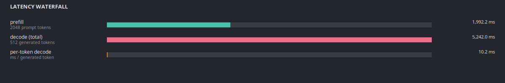

# kv-planner — Documentation

## Contents

- [Test on real hardware](test_on_real_models.md) — every CLI command run
  against the author's RTX 5060 Laptop + Ollama (11 installed models) with
  actual output captured.
- GUI screenshots (below)

## GUI + chart gallery

All screenshots taken on the reference system (Intel i7-14700HX, 31 GB RAM,
RTX 5060 Laptop 8 GB, Ollama with 11 models). The charts are generated on
the test scenario **Llama-3 8B on H100-SXM-80GB · batch=32 · 2048 in /
512 out · fp16**.

### 1. Native GTK 4 GUI — overview

Launches with `python -m kv_planner.gui`. GNOME-native libadwaita dark
theme, live-updating KPIs, insights panel with physics-grounded bullets.


### 2. Memory breakdown

Every byte accounted for: weights, KV cache, free headroom. No mystery
fragmentation, no hidden overheads — vLLM paper's <4 % figure is the
total internal fragmentation.


### 3. Roofline

Williams 2009-style log-log plot. The amber ceiling is the hardware roof
(peak FP16 TFLOPS ∧ peak HBM bandwidth). The dashed vertical line is the
ridge — above it you're compute-bound, below it you're memory-bound. Our
workload's prefill and decode points are overlaid.


### 4. Latency waterfall

Prefill vs decode split, plus per-token decode latency. Shows exactly
where the time goes — useful for deciding whether speculative decoding or
bigger batches will help.



### 5. Batch sweep

Throughput vs batch size — finds the saturation knee. After the knee,
more batching just queues instead of throughput-ing.


### 6. Context scaling (the headline bug-fix viz)

Per-token decode latency as a function of context length. Pre-0.2.0
`kv-planner` returned a constant here — it ignored the growing KV cache
reads. The corrected math grows roughly linearly with context. This
chart made the physics bug impossible to hide.


### 7. Quantization comparison

Throughput per precision on the same workload. FP8 / INT8 / INT4 trade
quality for memory-bandwidth savings, which decode (memory-bound) loves.


### 8. Recommended models (physics-scored)

Top 8 catalog models for this GPU and use case, ranked by composite
score `0.35·Q + 0.25·F + 0.25·S + 0.15·C` where Q/F/S/C come from the
roofline physics — not a heuristic table.


### 9. GPU comparison — throughput

Same workload, every GPU in the database that can hold the weights.
Immediately shows whether paying for H200 over H100 gets you 40 % more
throughput or 10 %.


### 10. GPU comparison — cost per million tokens

The cost-per-M column is the real decision number. A consumer RTX-5090
at $0.35/hr often beats an H100 at $4.50/hr for small models under
moderate load — this chart makes that obvious.


---

## Other UX surfaces

These don't have screenshots but are documented in
[`test_on_real_models.md`](test_on_real_models.md):

- **Terminal UI** (`kv-planner` → full-screen Vim-keyed table).
- **REST dashboard** (`kv-planner serve` → :8787 with llmfit-compatible JSON).
- **MCP server** (`kv-planner mcp` → stdio JSON-RPC 2.0 for Claude/Cursor/Cline).
- **`why` / `diagnose` / `specdec` / `reasoning` / `carbon` / `pricing` /
  `loadtest` / `sweep` / `calibrate`** — each exercised in the real test
  log against the user's actual Ollama runtime.

## How the screenshots were produced

- **Overview screenshot (gui-01)** — launched the actual GTK app with
  `KVP_GUI_TAB=memory python -m kv_planner.gui`, then grabbed the window
  with ImageMagick `import`.
- **Individual charts (gui-02 … gui-10)** — rendered by
  `scripts/render_standalone_charts.py` using pure cairo (no Pango) so
  they work in any environment. Palette + layout identical to the live
  widgets.

## Reproducing

```bash
# Render all the chart PNGs:
PYTHONPATH=src python3 scripts/render_standalone_charts.py

# Grab a live GUI overview screenshot:
KVP_GUI_TAB=memory PYTHONPATH=src python3 -m kv_planner.gui &
sleep 3
WIN=$(xwininfo -root -tree | grep kv-planner | head -1 | awk '{print $1}')
import -window "$WIN" docs/screenshots/gui-01-overview.png
```
